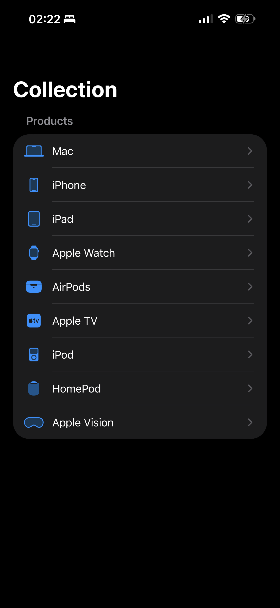
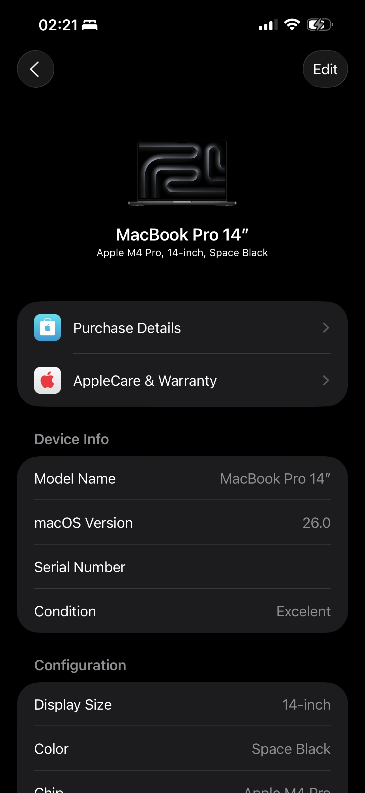

# Everlog

[](./LICENSE)
[]()
[]()

Everlog is a **SwiftUI app** for iOS and watchOS that lets you log, track, and manage all your Apple devices in one place. Keep detailed records of purchase dates, configurations, OS versions, device condition, and more. Data is stored locally using **SwiftData** and synced securely across devices with **CloudKit**.

---

## Features

* Log all your Apple devices (iPhone, iPad, Mac, Apple Watch, etc.)
* Track purchase dates, model, configuration, and condition
* iOS and watchOS support with native SwiftUI interface
* Cross-device sync via CloudKit
* Optional storage of sensitive data (e.g., serial numbers)
* Minimalist, modern, and intuitive UI

---

## Screenshots

<!-- Replace these with actual screenshots -->
<div>


</div>

---

## Installation

### Requirements

* iOS 26+ / watchOS 26+
* Xcode 26+
* Swift 6.2

### Steps

1. Clone the repo:

```bash
git clone https://github.com/radblesk/Everlog.git
```

2. Open `Everlog.xcodeproj` in Xcode.
3. Build and run on your simulator or device.
4. To test sync, ensure iCloud/CloudKit is enabled in your Apple ID.

---

## Contributing

We welcome contributions! See [CONTRIBUTING.md](./CONTRIBUTING.md) for the full guide.

* Fork the repo
* Create a branch in your fork
* Submit pull requests to `development` branch
* Localization contributions are highly encouraged

---

## Reporting Issues

Please report bugs or feature requests via GitHub Issues. For security concerns, see [SECURITY.md](./SECURITY.md).

---

## License

This project is licensed under the [Everlog License](./LICENSE).

---

## Acknowledgements

* Built with SwiftUI and SwiftData
* Inspired by minimalist design and Apple’s native app ecosystem
